<!--
  Painel vivo do perfil — regerado todo dia por painel/gerar.py (GitHub Actions, ~05:40 em Palmas/TO).
  Textos, stack e cores ficam em painel/config.json. Os SVGs de assets/ são gerados: não edite à mão.
-->

  

  

  

  ⚡ painel vivo · regerado todo dia por <a href="painel/gerar.py"><code>painel/gerar.py</code></a> · tokyo night · inspirado no omarchy

